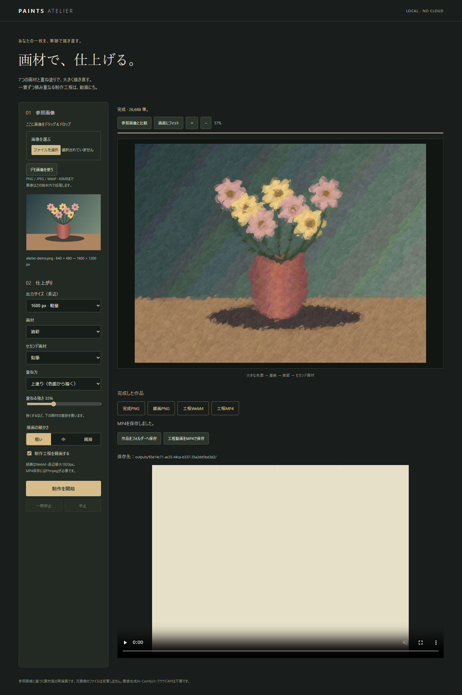

# Paints Atelier

**AIイラストを、画材で仕上げる。**

参照画像の色と輪郭から筆跡を組み立て、油彩・鉛筆・水彩・クレヨン・木炭・ソフトパステル・マーカーで描き直すローカルアプリです。2つの画材を重ねて、高解像度PNGと制作工程動画を書き出せます。

Local, stroke-based repainting for illustrations and photographs. Seven media, mixed-media layers, high-resolution PNG and process video. No image-generation model, GPU, ComfyUI, Python, cloud API, account or API key required. The interface is currently Japanese.



## 起動 / Quick start

Node.js 20以上をインストールし、次を実行します。実行時のnpmパッケージ依存はありません。

```sh
git clone https://github.com/Genzoh2026/paints-atelier.git
cd paints-atelier
npm start
```

ブラウザーで **http://127.0.0.1:4180** を開きます。Chrome / Edgeを推奨します。Windowsでは `Start Paints Atelier.cmd` でも起動できます。終了はサーバーの端末でCtrl+C。

## 使い方

1. 画像を選ぶ、ドラッグ＆ドロップする、または「デモ画像を使う」を選択。
2. 画材と出力サイズ、筆触の細かさを選択。
3. 必要ならセカンド画材を選択。「上塗り」は色面から4工程、「仕上げのみ」は細部の2工程を重ねます。
4. 「制作を開始」。一時停止・再開・中止ができます。
5. 完成PNG・線画PNG・工程動画を保存。画面フィット、パン・ズーム、参照画像との比較もできます。

録画はWebM（長辺最大1920px）。FFmpegが使える場合、完成時に圧縮MP4も自動保存します。画面のリンクから個別にダウンロードできます。

## MP4保存 / FFmpeg

FFmpegは別途必要です。FFmpeg本体はこのリポジトリには含まれません。`ffmpeg -version` が実行できるようPATHを設定するか、実行ファイルの場所を `FFMPEG_PATH` で指定して起動してください。実行ファイルを指定し、引数は付けないでください。

```powershell
# Windows PowerShell — 実際のインストール先に置き換える
$env:FFMPEG_PATH = 'C:\tools\ffmpeg\bin\ffmpeg.exe'
npm start
```

```sh
# macOS / Linux — PATHにffmpegがあれば環境変数は不要
FFMPEG_PATH=/path/to/ffmpeg npm start
```

H.264（libx264）/ CRF 23 / medium / yuv420p / faststartで変換します。奇数の辺は1px余白を追加して偶数にします。変換済みMP4は再利用され、元WebMも残ります。圧縮後の容量は映像内容によって異なります。FFmpegがない場合も描画・PNG・WebMは利用できます。「工程動画をMP4で保存」から再試行できます。

## 保存とプライバシー

- 画像の解析・描画はブラウザー内。外部サーバーへの画像送信はありません。
- ローカルサーバーは `127.0.0.1` のみで待ち受けます。インターネット公開用サーバーではありません。
- 完成ファイルは `outputs/<作品ID>/painting.png`、`sketch.png`、`process.webm`、`process.mp4`。
- `outputs/` はGit管理から除外しています。元画像は変更しません。
- 画像差し替え・再制作で画面内の前作を破棄します。保存済みファイルは残ります。
- ブラウザーの再読み込み・終了後の編集状態復元には未対応。制作・録画中はブラウザーのタブを開いておいてください。
- 60MB以下のPNG/JPEG/WebP、最大6400万画素・各辺16000px。出力長辺1600/2400/3344/4096px。大きな画像・繊細設定は時間とメモリーを使います。

## どのように描くか

色・明暗・輪郭方向を参照し、大きな筆から小さな筆へ4工程で重ねます。筆跡には再現可能な擬似乱数を使用します。セカンド画材は同じ参照画像を使い、主画材の上へ描きます。

出力キャンバスに画材の粒・毛筋・帯状の跡を描く仕組みで、失われた元画像の細部を復元する超解像モデルではありません。顔・文字の意味認識、顔料の物理シミュレーション、印刷品質の保証はありません。

## 開発・テスト

```sh
npm test
npm run check
```

`npm test` は描画工程・42通りの画材ペア・保存境界を検証します。FFmpegが見つかる場合は実MP4変換テストも実行し、ない場合はそのテストのみskipします。

ブラウザーテストはPlaywrightとChromium、およびFFmpegが必要です。

```sh
npm install --no-save --package-lock=false playwright
npx playwright install chromium
npm run test:browser
```

テスト生成物は `test-results/` に保存します。既存Chromeを使う場合は `CHROME_PATH`、別のPlaywrightインストールを使う場合は `PLAYWRIGHT_PATH` を設定できます。

## 構成

- `src/oil/` — 参照解析、筆跡計画、画材、Worker、録画
- `src/app.js` — 操作と制作の調停
- `src/viewport.js` — 表示倍率・フィット・パン
- `src/output.js` — ローカル保存API
- `server/storage.mjs` — 保存境界・固定ファイル名
- `server/mp4.mjs` — FFmpegによる圧縮
- `server/http.mjs` — ローカルHTTPと静的ファイル配信

組み込み版から独立して切り出したクローンです。元アプリ・ComfyUI-labのファイルや起動設定を変更しません。デモはコードで生成した静物画で、個人画像や第三者の写真は含みません。

## License

ライセンスは未設定です。公開リポジトリとしてコードを閲覧できますが、再配布・改変利用に関するライセンスはまだ付与していません。
